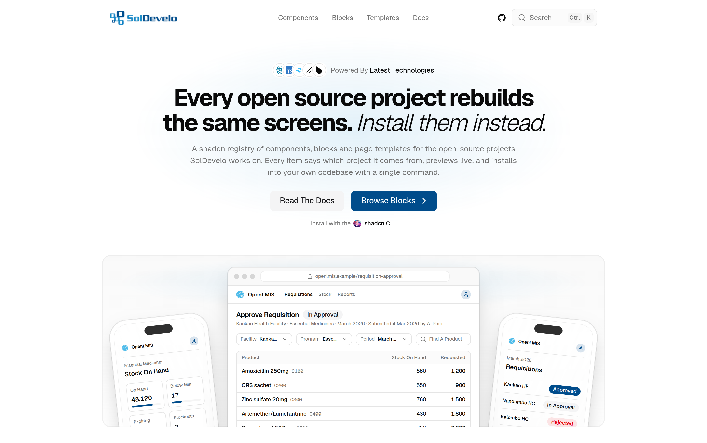

<p align="center">
  <a href="https://registry.soldevelo.com">
    <picture>
      <source media="(prefers-color-scheme: dark)" srcset="public/soldevelo-dark.svg">
      
    </picture>
  </a>
</p>

<h1 align="center">SolDevelo Registry</h1>

<p align="center">
  Every open source project rebuilds the same screens. Install them instead.
</p>

<p align="center">
  <a href="https://registry.soldevelo.com">Catalog</a>
  &nbsp;·&nbsp;
  <a href="https://registry.soldevelo.com/docs">Docs</a>
  &nbsp;·&nbsp;
  <a href="./REGISTRY.md">Item Index</a>
  &nbsp;·&nbsp;
  <a href="./CHANGELOG.md">Changelog</a>
</p>

<p align="center">
  
  
  
  
  
  <a href="./LICENSE"></a>
</p>

<p align="center">
  <a href="https://registry.soldevelo.com">
    
  </a>
</p>

A [shadcn](https://ui.shadcn.com) registry of **components**, **blocks**, and
**page templates** for the open-source projects [SolDevelo](https://soldevelo.com)
works on, plus the catalog site that previews every item live and shows its
source.

The registry is multi-project. Every item says which project it belongs to, and
the catalog shows that project beside it, so you can always tell where a block
came from. [OpenLMIS](https://openlmis.org) is the first project.

One command copies the source into your repository. There is no wrapper package
and no runtime dependency on this site. The code is yours to edit from the first
paste.

## Install

Any React project with the shadcn CLI configured will do, including a workspace
inside a monorepo. Items are built on Base UI, so your `components.json` needs a
`base-*` style, which is the `shadcn init` default.

Register the namespace once by merging this into the `registries` object of
your `components.json`:

```json
{
  "registries": {
    "@soldevelo": "https://registry.soldevelo.com/r/{name}.json"
  }
}
```

Then install any item by name. Names are prefixed with their project:

```sh
pnpm dlx shadcn@latest add @soldevelo/openlmis-status-badge
```

The CLI also installs the shadcn primitives and npm packages the item depends
on. Search and inspect the catalog from the terminal too:

```sh
pnpm dlx shadcn@latest search @soldevelo -q "stock"
pnpm dlx shadcn@latest view @soldevelo/openlmis-status-badge
```

## What You Can Install

| Kind      | What it is                                                        | Installs to                                             |
| --------- | ----------------------------------------------------------------- | ------------------------------------------------------- |
| Component | One primitive that renders a domain value consistently            | `components/{project}/{item}.tsx`                       |
| Block     | A complete screen region, with layout and dark mode handled       | `components/blocks/{project}/{item}.tsx`                |
| Template  | A whole page, shipped with editable copies of every section in it | `app/{item}/page.tsx` + `components/{project}/{item}/*` |

Every item is previewed live in the catalog at
[/components](https://registry.soldevelo.com/components),
[/blocks](https://registry.soldevelo.com/blocks) and
[/templates](https://registry.soldevelo.com/templates), with its source beside
the preview. [`REGISTRY.md`](./REGISTRY.md) is the full index, regenerated from
the registry on every build.

## Projects

 **[OpenLMIS](https://openlmis.org)**:
an open-source electronic logistics management information system for public
health supply chains. Requisition, stock and facility screens.

Every project renders in the same SolDevelo theme. A project's own colours
appear only in its logo, so items from different projects sit together without
clashing.

## Built For Agents

The catalog is machine readable, not just browsable.

- [`llms.txt`](https://registry.soldevelo.com/llms.txt) summarises every item
  for LLM crawlers.
- [`REGISTRY.md`](./REGISTRY.md) is the same index for humans and coding
  agents working in a checkout.
- The shadcn MCP server reads the registries in your `components.json`, so once
  the namespace is registered your agent can search and install from it:

```sh
pnpm dlx shadcn@latest mcp init --client claude
```

Swap `claude` for `cursor`, `vscode` or `codex` as needed.

## Development

```sh
pnpm install
pnpm dev
```

| Command               | What it does                                             |
| --------------------- | -------------------------------------------------------- |
| `pnpm dev`            | Dev server on `localhost:3000`                           |
| `pnpm build`          | Production build, type-checked                           |
| `pnpm lint`           | oxlint, including the `@shadcn/lint` design-system rules |
| `pnpm typecheck`      | `next typegen && tsc --noEmit` (TypeScript 7)            |
| `pnpm format`         | Oxfmt, with Tailwind class sorting                       |
| `pnpm registry:build` | Regenerate every derived registry artifact               |
| `pnpm registry:check` | Rebuild and fail if the committed artifacts are stale    |

The registry has one authored source of truth and several generated outputs:

```
registry/registry-items.ts                  AUTHORED   the only place an item is declared
registry/{components,blocks,templates}/**   AUTHORED   the source files
        │
        │  pnpm registry:build
        ▼
config/{components,blocks,templates}.ts     GENERATED  site data with embedded source
registry.json                               GENERATED  input for `shadcn build`
public/r/*.json                             GENERATED  what the shadcn CLI installs
REGISTRY.md, public/llms.txt                GENERATED  catalog indexes
```

Generated files are committed and never edited by hand. `pnpm registry:check`
fails CI if they drift from the source.

`PRODUCTION_URL` in `config/site.ts` is the origin baked into canonicals and the
committed artifacts. It is a constant rather than an env var so that a local
`pnpm registry:build` can never publish `localhost` URLs. Preview deploys
override it with `NEXT_PUBLIC_SITE_URL`.

## Adding An Item

1. Write the source under `registry/{components,blocks,templates}/{project}/{item}/`,
   with a `page.tsx` beside it that the catalog previews.
2. Declare it in `registry/registry-items.ts`. The `name` must be
   `{project}-{item}` and `meta.project` must match.
3. Run `pnpm registry:build`, then `pnpm lint && pnpm typecheck`.
4. Load the preview, measure its height, and set `meta.height` to it.
5. Commit the source together with the regenerated artifacts.

Item source must be copy-pasteable: shadcn primitives, declared npm packages
and its own sibling files, nothing else. A new project is an entry in
`config/projects.ts` plus a square logo at `public/projects/{id}.png`.

[`CLAUDE.md`](./CLAUDE.md) has the full conventions, including the design-system
rules the linter enforces.

## Stack

Next.js 16 (App Router) · React 19 · TypeScript 7 · Tailwind CSS v4 ·
shadcn/ui on Base UI · Motion · oxlint with `@shadcn/lint` · Oxfmt

## Contributing

Issues and pull requests are welcome. Read an item's source, edit it, or send a
pull request that adds your own. Commits follow
[Conventional Commits](https://www.conventionalcommits.org/).

## License

[MIT](./LICENSE). Copyright SolDevelo.
